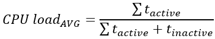
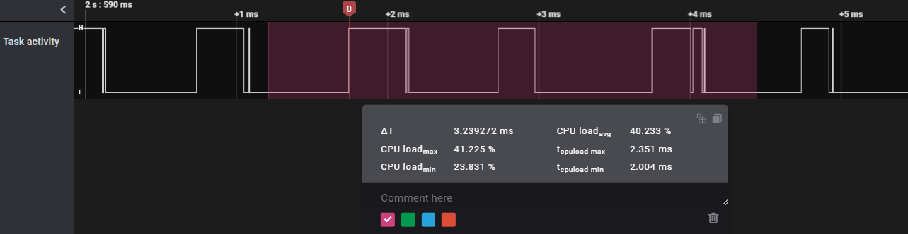
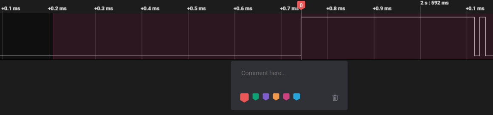
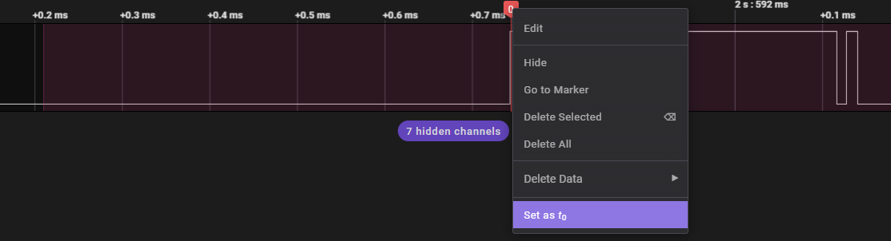

# CPU load analyzer

## Brief description
CPU load monitor is a tool for an embedded systems analysis (e.g. worst case analysis). The main functionality is a calculation of the average CPU load of a captured activity and is represented by the equation:

Additional feature includes calculation of a system CPU load in worst case and best case and it is performed as a "moving" CPU load from 1 ms period. The tool also shows the time of the worst/best case to make it easier to analyze the examined system. The time in measurement tool points to the end of worst/best case (radical activity is before the presented time).

## Installation
You can install the extension using an Extensions bookmark.

## Usage
1. Set one of GPIO pins of your system to map a system activity
2. Connect pin to the Saleae
3. Capture few moments of system activity
4. Add measurement on a channel with captured system activity with minimum length of 1 ms starting from rise edge

5. Add a Single Marker and stick it to first analyzed rising edge

6. Click with a right mouse button and click on "Set as t0"

## Known issues and limitations
[0.0.1] - Known issue is a presentation of the CPU load max and min time from first analyzed rising edge, not the beggining of the measurment of absolute capture time. As a workaround solution you can set t0 at the first rising edge of analyzed signal.

#### Remarks:
1. CPU load period is set to 1 ms by default (as the most popular OS tick).
2. CPU load calculation is started from the first rising edge of the task activity signal.

#### Sponsorship
Extension development is sponsored by Merit Automotive.

https://www.merit-automotive.com/
